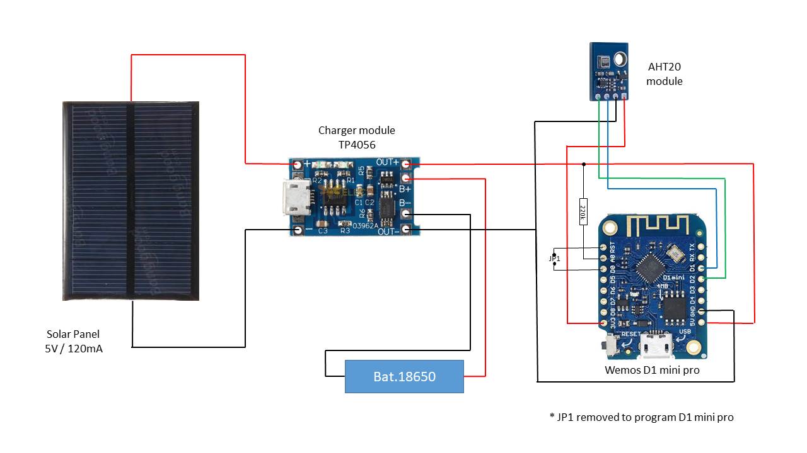

Temperature Sensor
=================

This is a simple Temp Sensor based on a Wemos D1 mini pro v2 (from LOLIN) and an AHT20 temp/humidity sensor.

The sensor is aimed to be installed outside the house and periodically send
temperature and humidity data to a Weather Station.

This repo contains the code used.

Sources of inspiration : 

* [Solar Powered WiFi Weather Station V2.0](https://www.instructables.com/Solar-Powered-WiFi-Weather-Station-V20/)

# Description

The temperature sensor is connected to WiFi (configuration is done using an Autoconnect Acces Point based on 
@tzapu WiFiManager Library). 

In my house, I am using the WiFi guest network and I choosed to fix the IP address for the temperature Sensor (as well for the Weather Station)

The sensor collects temperature and humidity values from the AHT20 module, calculates the remaining voltage
of the 16850 battery, and send this data to the ReST API web server hosted by the Weather Station every 20mn (this is
configurable).

Schematic of the sensor is very simple and derived from  [Solar Powered WiFi Weather Station V2.0](https://www.instructables.com/Solar-Powered-WiFi-Weather-Station-V20/) :

